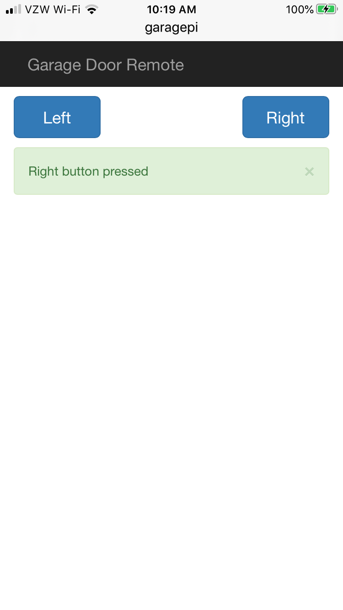
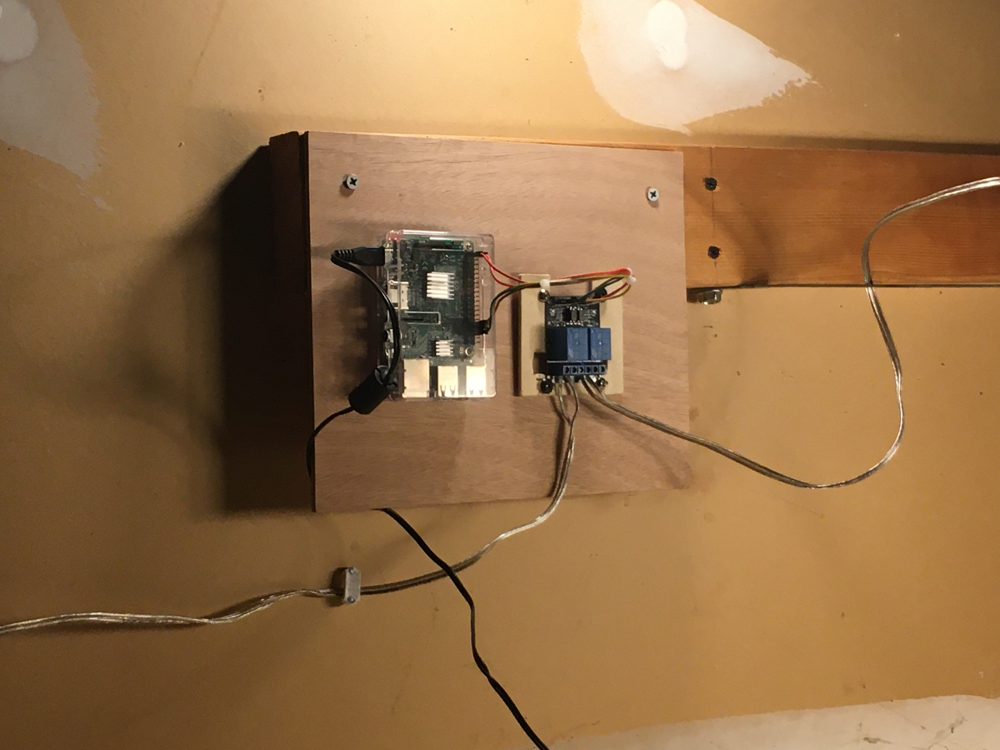

# raspberrypi
This project investigates using the Raspberry Pi to control two relays. The relays each control a garage door. The Raspberry Pi presents a simple web page to allow control of the left or right garage door. This web page can be accessed by a cell phone connected to my LAN.

# Motivation
I became tired of paying for garage door openers which were frequently failing. I also didn't want to carry another device specifically for opening the garage door.. I wanted to be able to open and close either garage door using my cell phone.

# Screenshots
<table>
  <tr>
    <td></td>
    <td></td>
  </tr>
</table>

# Features
* Raspberry Pi controlling two relays on a relay board.
* Code authenticates user without using login/password.
* User recieves feedback for each command processed.
* Each activity is logged.

# Hardware
The hardware list is short and simple.
* A Raspberry Pi 3 B (other Raspberry Pis may work)
* A dual relay board with optical couplers
* 5 female/female jumper wires
* Speaker wire to each garage door opener (door bell wire may work)

# Software
Python is used to control the relays through the GPIO pins. The relay control occurs in one module. The press() function momentarily switches a relay and then turns it back off. Configuration is via the YAML file, static/config.yaml.

The IP address must be part of the LAN. Once the LAN member ship is verified the MAC address is retrieved from the ARP (Address Resolution Protocol) process. The MAC address is checked against the list of approved MAC addresses.

The main module, app.py, brings everything together. All activity (button presses) will be logged. The log files will rotate every day with the maximum of 7 log files. All configuration is maintained the the static/config.yaml file.

The user interface is provided by the Flask micro web framework and flask_bootstrap. The user interface is a title, two buttons and message area that appears below the buttons when they are pressed. Two error pages are available for errors 403 _forbidden_ and 500 _internal server error_.

# Installation
Make sure you have the latest Python 3 release installed on your Raspberry Pi. Clone the software into the installation location.
```
$ git clone https://github.com/chrisPieper/raspberrypi.git
```
Change directory to the 'raspberrypi' directory. 
```
$ cd raspberrypi
```
Next you need to create a virtual environment as a place for the code to run.
```
$ python3 -m venv venv
```
Start the virtual environment.
```
$ source venv/bin/activate
```
At that point the virtual environment should be populated using 'pip'.
```
(venv) $ pip install wheel
```
'wheel' is used by other packages so it is useful to install it at this point. Next load the other packages using the 'requirements.txt' file.
```
(venv) $ pip install -r requirements.txt
```
Change directory (like before) only this time to the 'webapp' directory. Once you are in the 'webapp' directory of the Raspberry Pi you can run the application, starting the web page for the 'raspberrypi' software on port 5000 (assuming no changes have been made).
```
(venv) $ python3 app.py
```
Now you should be able to go to the Rapberry Pi computer's name (or its IP address) at port 5000 to open/close the garage doors (assuming the hardware connections are complete.
```
http://<raspberry pi name>:5000
```
At that point you should be greeted with the 'Garage Door Remote'. Configure 'webapp/static/config.yaml' to work with your environment.
